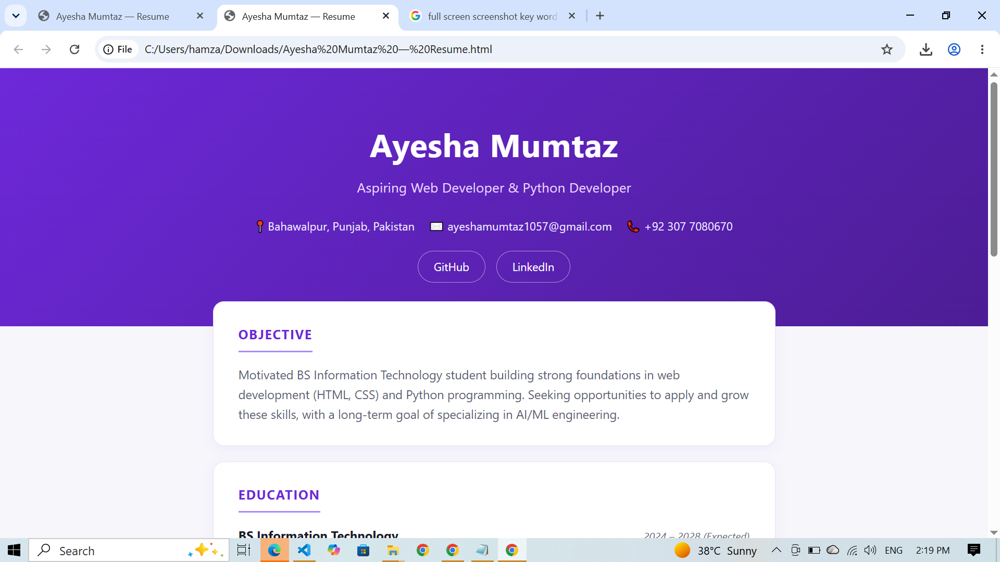

# 🌟 Personal Resume Website

> A clean, modern, and fully responsive personal resume website built with **HTML5** and **CSS3**.

This project showcases my education, technical skills, featured projects, and career aspirations in a professional and responsive web portfolio. It reflects my journey as a **Bachelor of Science in Information Technology (BSIT)** student who is passionate about technology, programming, and continuous learning.


---


## 🚀 Live Demo

🔗 **GitHub Pages**

https://github.com/ayeshamumtaz1057/resume-website

---

## ✨ Features

* 🎨 Modern and elegant interface
* 📱 Fully responsive design
* 👩 Professional resume layout
* 🎓 Education section
* 💻 Featured projects
* 🛠️ Technical skills
* 📞 Contact information
* 🔗 GitHub & LinkedIn integration
* ⚡ Lightweight and fast loading


---

## 🛠️ Tech Stack

| Technology   | Description                   |
| ------------ | ----------------------------- |
| HTML5        | Semantic webpage structure    |
| CSS3         | Styling and responsive design |
| Git          | Version control               |
| GitHub       | Code hosting                  |
| GitHub Pages | Website deployment            |

---

## 📂 Project Structure

```text
resume-website/
│
├── index.html
├── style.css
├── screenshot.png
└── README.md
```

---

## ⚙️ Getting Started

### Clone the repository

```bash
git clone https://github.com/ayeshamumtaz1057/resume-website.git
```

### Navigate to the project

```bash
cd resume-website
```

### Run the project

Open **index.html** in your preferred web browser.

---

## 🎯 Project Goals

This project was developed to:

* Practice semantic HTML5
* Improve CSS3 styling techniques
* Build responsive web layouts
* Create a professional online resume
* Learn Git & GitHub workflow
* Prepare a portfolio for future opportunities

---

## 📚 Skills Demonstrated

* HTML5
* CSS3
* Responsive Web Design
* Flexbox
* UI Design
* Git
* GitHub
* GitHub Pages

---

## 👩‍💻 About Me

I'm **Ayesha Mumtaz**, a BS Information Technology student with a growing interest in **Python, SQL, Data Analysis, Microsoft Excel, Power BI, and Artificial Intelligence**.

I enjoy building practical projects that strengthen my programming skills while preparing for a career in **Data Analytics**.

---


---

## 🤝 Connect With Me

**GitHub**
https://github.com/ayeshamumtaz1057

**LinkedIn**
https://www.linkedin.com/in/ayesha-mumtaz-82b8913a9

---
 ## 📸 Preview

<p align="center">
  
</p>
---

## ⭐ Support

If you found this project helpful or inspiring, please consider giving it a **⭐ Star** on GitHub. Your support encourages me to continue learning, improving, and sharing more projects.

Thank you for visiting my repository! 🚀


